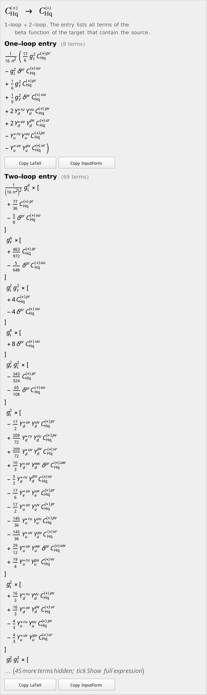

# SMEFT ADM Explorer

**An interactive map of how dimension-six SMEFT operators mix under renormalization-group running, at one and two loops.**

Pick an operator and see which operators it runs into, or which operators generate it. Click any arrow to read the full anomalous-dimension entry, typeset and ready to copy as LaTeX or Mathematica code.


The data are the one- and two-loop beta functions of the dimension-six SMEFT in the **Mainz basis**, from Born, Fuentes-Martín and Thomsen, *Next-to-Leading Order Running in the SMEFT*.

## Getting started

**Requirements:** Mathematica 14.2 or newer (with the front end). Nothing else: no Matchete, no extra packages, no internet connection.

1. Download these **three files** into the **same folder** (or simply clone or download the whole repository):
   * `SMEFT_ADM_Explorer.nb`: the notebook
   * `SMEFTADMExplorer.m`: the code
   * `ADMData.wxf`: the preprocessed data
2. Open `SMEFT_ADM_Explorer.nb` in Mathematica. The two initialization cells (load and launch) run on open and the explorer appears. If your Mathematica asks whether to evaluate initialization cells, accept; otherwise evaluate the cells by hand with Shift+Enter.

The first view is centered on C<sub>H</sub>. Everything else is point and click. If the explorer does not appear, check that the three files really are in the same folder: the notebook looks for the other two next to itself.

## What you see

| | |
|---|---|
| **Nodes** | the 59 operators, colored by operator class |
| **Red arrow** | the mixing is nonzero at one loop (a two-loop part may exist as well) |
| **Green dashed arrow** | the mixing first appears at two loops |
| **Navy halo** | (*1-loop squared* mode) an operator reached only through a chain of two one-loop steps, i.e. genuinely new at order (γ<sup>(0)</sup>)<sup>2</sup> |
| **Badge on the center** | whether the operator mixes into itself at one and two loops |

Operators with many neighbors are spread over up to three rings, ordered by class. Arrows to outer rings are longer but never cross another operator.

| Many neighbors (here 56) | Chains of two one-loop steps |
|---|---|
|  |  |

## Using it

| Do this | To get this |
|---|---|
| Type in the search field, or use the class and operator menus | choose the center operator (`Back` returns to the previous one) |
| **Direction**: *Runs into* / *Generated by* | edges center → X, or X → center (never both at once) |
| **Mode**: *1-loop only* / *1-loop + 2-loop* / *1-loop squared* | direct one-loop edges; one- and two-loop edges; or two-step chains of one-loop edges |
| **Layout**: *Radial* / *Spring* | ordered rings, or a free-floating arrangement |
| Tick or untick operator classes | hide or show whole classes |
| Hover over an arrow | the coupling combinations involved and whether it goes through the conjugate |
| **Click an arrow** | the full entry in the side panel, with *Copy LaTeX* and *Copy InputForm* buttons |
| **Click an operator** | recenter the graph on it |

<p align="center"></p>

## Conventions

* β = dC/d ln μ, and ħ ≡ 1/(16π²). Every entry is shown as a prefactor 1/(16π²)<sup>L</sup> times the L-loop terms.
* An arrow C<sub>j</sub> → C<sub>i</sub> means that β<sub>C<sub>i</sub></sub> contains a term linear in C<sub>j</sub> (or its conjugate). The entry shows exactly those terms.
* Operators and labels follow the Mainz basis: (∥) and (×) denote parallel and crossed index contractions, and gauge couplings are built into the X³, X²H² and ψ²XH operators. Couplings are written g<sub>Y</sub>, g<sub>L</sub>, g<sub>s</sub>.
* Flavor indices are explicit: p, r, s, t are the free indices and a repeated index is summed.
* Not shown: terms quadratic in the Weinberg operator, the running of the SM couplings and θ-terms, and self-running as an arrow (it appears as the badge on the center node).

<details>
<summary><b>For developers: rebuilding and testing</b></summary>

Everything is generated from `Input files/SMEFT_beta_functions.m` by `wolframscript` (Mathematica ≥ 14, no Matchete needed):

```
wolframscript -file make_all.wls         # data cache, notebooks, snapshots (about 20 s)
wolframscript -file tests/run_tests.wls  # headless acceptance tests (about 6 min)
```

In a notebook, the package can also be used directly:

```mathematica
Get["SMEFTADMExplorer.m"];
SMEFTADMExplorer["ADMData.wxf", "cHq1"]          (* the explorer, centered on C_Hq^(||) *)
ToTeXString[expr]                                 (* LaTeX of a beta-function expression in Matchete notation *)
```

| File | Purpose |
|---|---|
| `SMEFT_ADM_Explorer.nb` | the notebook; loads the two files below from its own folder |
| `SMEFTADMExplorer.m` | the package |
| `ADMData.wxf` | cached, preprocessed ADM data |
| `make_all.wls`, `tests/` | rebuild script and acceptance tests |

</details>
