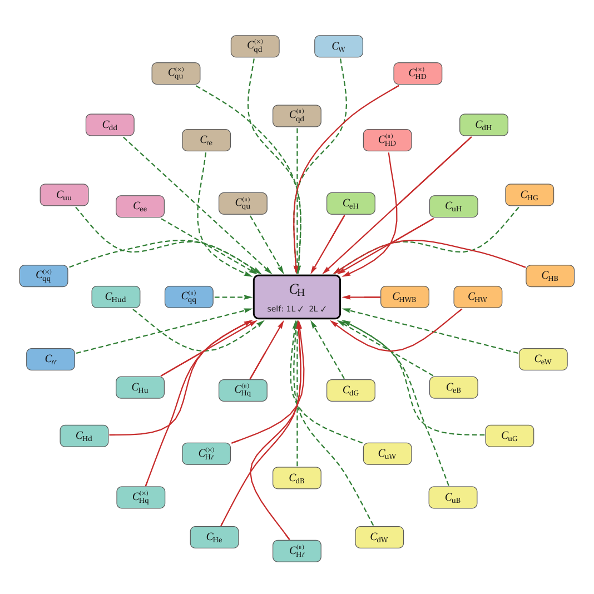
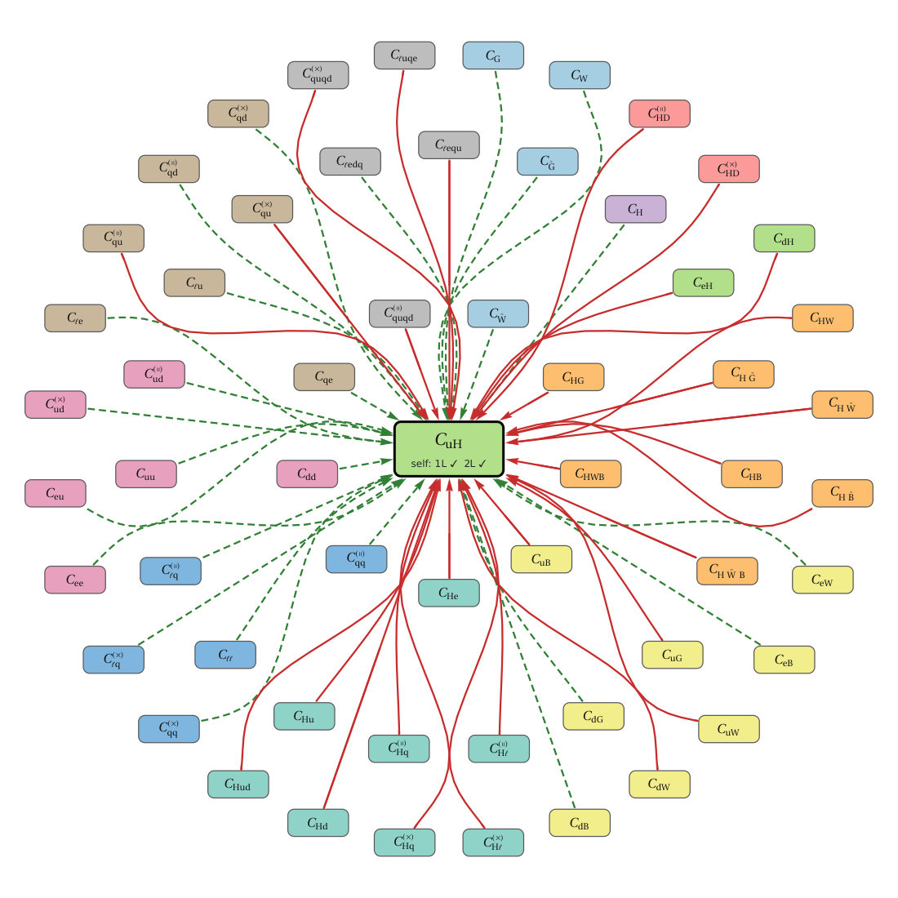
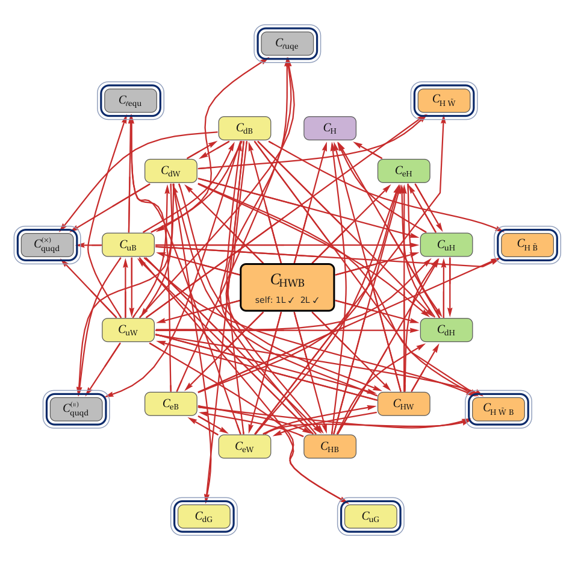

# Interactive SMEFT ADM Explorer

An interactive Mathematica graph explorer for the one- and two-loop anomalous dimension matrix (ADM) of the dimension-six SMEFT in the **Mainz basis** (Born, Fuentes-Martín, Thomsen, *Next-to-Leading Order Running in the SMEFT*). Pick an operator and see which operators it runs into, or which operators generate it, at one loop, at one and two loops, or through chains of two one-loop steps. Click an arrow for the full entry (typeset, with *Copy LaTeX* and *Copy InputForm* buttons).



## Quick start

* **Just use it:** open `SMEFT_ADM_Explorer.nb` in Mathematica (tested with 14.2) and evaluate the initialization cells (the front end asks for confirmation when the notebook opens). The notebook is self-contained: the package source and the ADM data are embedded (1.6 MB). It does **not** need Matchete.
* **From any notebook:**

  ```mathematica
  Get["SMEFTADMExplorer.m"];
  SMEFTADMExplorer["ADMData.wxf"]            (* starts centered on C_H *)
  SMEFTADMExplorer["ADMData.wxf", "cHq1"]    (* start centered on C_Hq^(||) *)
  ```

* **Rebuild everything** (data, notebooks, snapshots): `wolframscript -file make_all.wls`. Or step by step:

  ```mathematica
  Get["SMEFTADMExplorer.m"];
  BuildADMData["Input files/SMEFT_beta_functions.m", "ADMData.wxf"]   (* about 15 s, one-time *)
  MakeExplorerNotebook["SMEFT_ADM_Explorer.nb", "EmbedData" -> True]  (* or False: loads the .m/.wxf next to it *)
  ```

* **Run the acceptance tests:** `wolframscript -file tests/run_tests.wls`.

The explorer needs the Mathematica front end (it is an interactive UI). `BuildADMData` and the tests run headless with `wolframscript`.

## What the controls do

| Control | Effect |
|---|---|
| Search field / class menu / operator menu | choose the center operator (IDs are the Matchete keys, e.g. `cHq1`; `Back` returns to the previous centers) |
| Direction | *Runs into*: edges center → X. *Generated by*: edges X → center. Never both at once |
| Mode | *1-loop only*; *1-loop + 2-loop (direct)*; *1-loop squared*: chains center → X → Y (or Y → X → center) built from one-loop edges |
| Layout | *Radial*: center in the middle, up to three concentric rings with all operators ordered by class; *Spring*: deterministic force-directed |
| Options | self-running badge on the center node; exclude trivial chains (`center → X → center`); edge thickness |
| Operator classes | tick boxes hide classes; the swatches are the node colors |
| Hover over an arrow | highlights it and shows source → target, 1-loop/2-loop, the coupling monomials and whether it goes via the conjugate |
| Click an arrow | full entry in the side panel (one- and two-loop part, each with *Copy LaTeX* / *Copy InputForm*); in chain mode both legs of the chain |
| Click a node | recenter on that operator |

Arrows: **red** = nonzero at one loop (a two-loop part may exist as well), **green dashed** = nonzero only at two loops. In *1-loop squared* mode all arrows are one-loop edges; operators that are reached *only* through a chain and by no direct one-loop edge, i.e. genuinely new at order (γ⁽⁰⁾)², carry a navy halo.

With many neighbors (up to 56) the operators are spread over two or three rings. Arrows to outer rings are longer and are routed through the gaps of the inner rings, and edges between nodes are routed around all other nodes (shortest path in a visibility graph). `tests/run_tests.wls` verifies that no arrow touches a node it does not start or end at, for all 354 radial views.

| 56 neighbors, three rings | chains (1-loop squared) |
|---|---|
|  |  |

## Conventions and data

* Input: `Input files/SMEFT_beta_functions.m` (read only). It is an `Association` `<| C -> beta_C, ... |>` in Matchete notation. `BuildADMData` reads it in an isolated context, so the result is the same with or without Matchete loaded, and nothing in the UI touches the raw file.
* β = dC/d ln μ with **ħ ≡ 1/(16π²)**: one-loop terms ∝ ħ, two-loop terms ∝ ħ². The entries in the UI and in the LaTeX strings show the prefactor `1/(16π²)^L` in front and the ħ stripped.
* An edge Cj → Ci exists if β_Ci contains a term **linear** in Cj or in its conjugate. The stored entry for (Cj, Ci, L) is literally the sum of all loop-L terms of β_Ci that contain Cj, with the Wilson coefficient kept. Terms with two Weinberg-operator insertions (129 terms, `cllHH·Bar[cllHH]`) are excluded, as are the non-operator keys (SM couplings, θ-terms, `Bar` duplicates; 33 keys). The build checks that extracted plus excluded terms reproduce every β exactly.
* Self-running (diagonal entries) is not drawn as an arrow but shown as a badge on the center node (`self: 1L ✓ 2L ✓`).
* Operators are the 59 baryon-number-conserving dimension-six operators of the Mainz basis. Labels follow the paper: `(∥)` and `(×)` mean parallel and crossed contractions (Matchete suffixes `1` and `2`). Gauge couplings are displayed as g_Y, g_L, g_s.
* **Flavor indices are written explicitly** (free indices p, r, s, t; summed indices u, v, w, …; a repeated index is a sum). Matrix notation was considered and rejected for this data: many terms contract four-index operators only partially with Yukawas or carry Kronecker deltas, so they cannot be written as matrix products, and mixing both notations would be harder to read.

### Cache layout (`ADMData.wxf`)

A single `Association` (WXF with compression, 1.1 MB; read with `LoadADMData`):

```
"Meta"          source, build date, convention, loop marker, SHA-256 of the input
"Operators"     59 IDs in class order;  "Classes"  {id, name, TeX};  "OperatorInfo"  Label (typeset), TeX, Class, Hermitian
"Edges"         <| {src, tgt} -> <| "L1","L2" (flags), "Terms1","Terms2" (context-free term lists),
                   "Input1","Input2" (Matchete-notation strings), "TeX1","TeX2", "Couplings1","Couplings2",
                   "ViaConjugate" ("No"|"Yes"|"Both"), "NTerms1/2", "Size1/2" (LeafCount of the raw expression) |> |>
"SelfRunning"   same fields for the diagonal entries
"Excluded"      non-linear terms, terms without WC, non-operator keys
"Checks"        exactness check of the extraction
```

Differences to the roadmap sketch: the raw expressions are stored as `"Input"` strings (Matchete notation, symbols without context) plus a context-free term representation; `EdgeExpressionHeld[data, {src, tgt}, L]` rebuilds the held raw expression on demand. Numerical edge weights can be added later as an extra field per edge.

## Files

| File | Purpose |
|---|---|
| `SMEFTADMExplorer.m` | the package: `BuildADMData`, notation layer (`ToTeXString`, `ToCleanExpression`), graph logic (`ExplorerGraphData`), layout/routing, rendering, UI, `MakeExplorerNotebook` |
| `ADMData.wxf` | cached, preprocessed data |
| `SMEFT_ADM_Explorer.nb` | stand-alone notebook (embedded package and data) |
| `SMEFT_ADM_Explorer_linked.nb` | small notebook that loads `SMEFTADMExplorer.m` and `ADMData.wxf` from its own folder |
| `make_all.wls` | rebuilds data, notebooks, snapshots |
| `tests/run_tests.wls` | headless acceptance tests |
| `snapshots/` | PNG snapshots used above |

## Not included (possible extensions)

Explicit flavor indices; numerical edge weights at a reference scale; path finder between two arbitrary operators; numerical RG evolution; observable tagging; web export.
